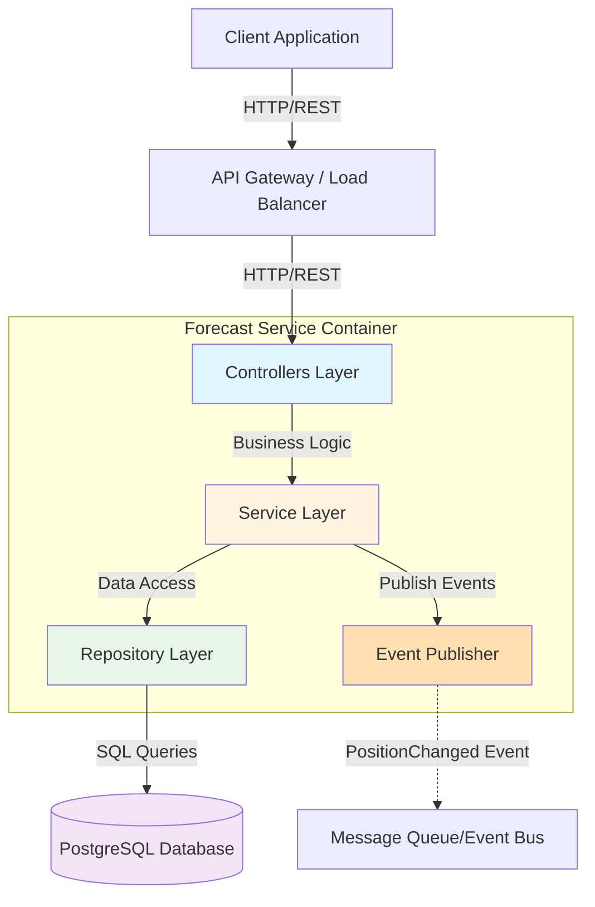
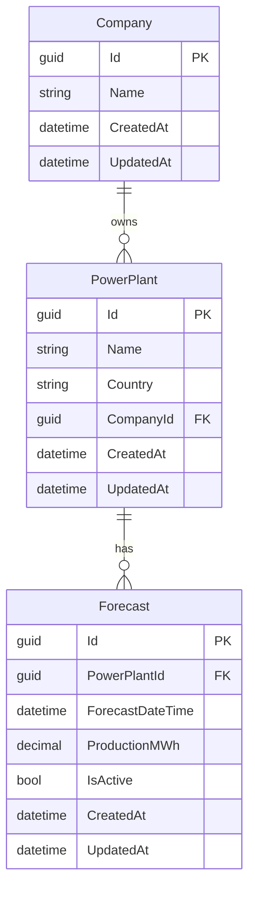
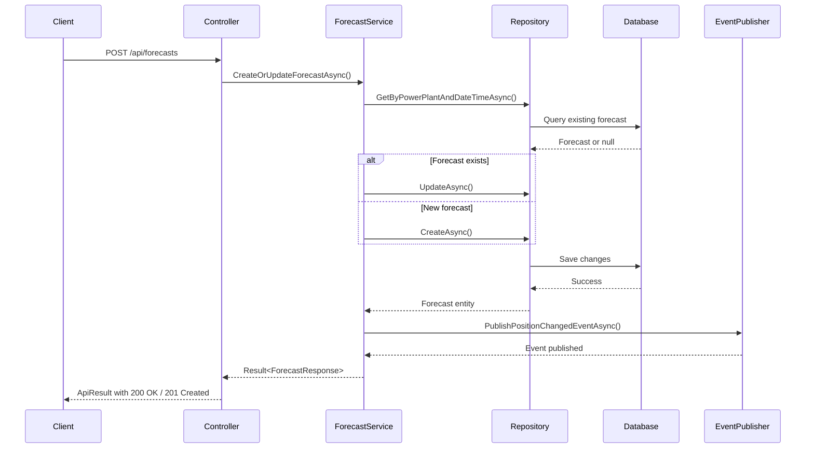
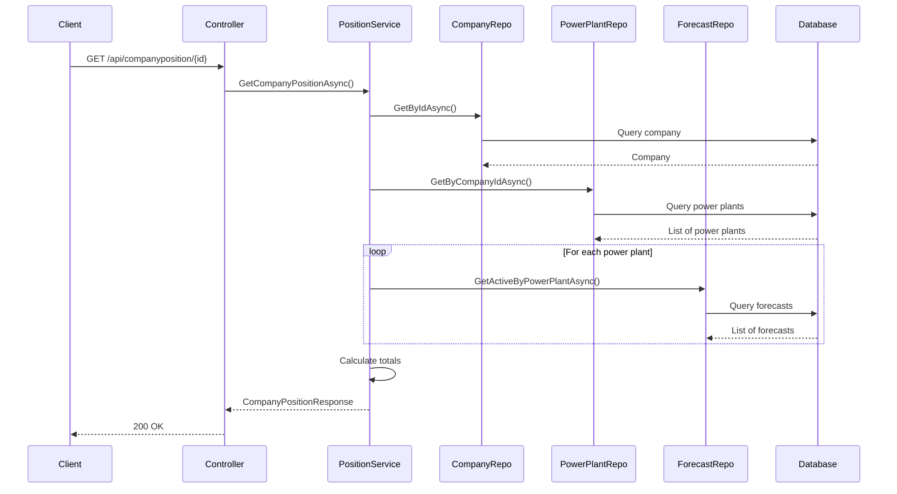
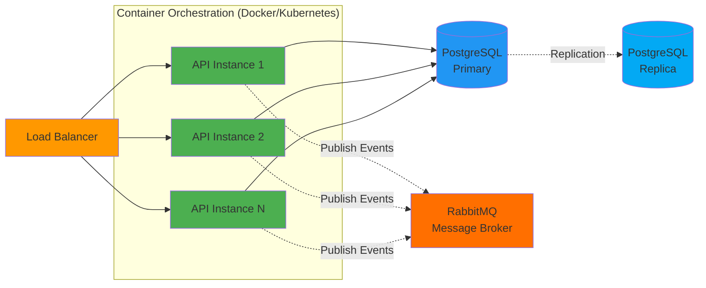

# Forecast Service - Architecture Document

## 1. Overview

The Forecast Service is a microservice designed for managing power plant production forecasts in an energy trading platform. It provides RESTful APIs for creating, updating, and retrieving forecast data, as well as calculating company-wide position aggregations across multiple power plants.

## 2. System Architecture

### 2.1 Architectural Pattern

The service follows **Clean Architecture** principles with a clear separation of concerns across four layers:

```
┌─────────────────────────────────────────────────────────┐
│                    API Layer                            │
│  (Controllers, Request/Response Handling, Middleware)   │
└────────────────────┬────────────────────────────────────┘
                     │
┌────────────────────▼────────────────────────────────────┐
│               Application Layer                         │
│    (Business Logic, Services, DTOs, Interfaces)        │
└────────────────────┬────────────────────────────────────┘
                     │
┌────────────────────▼────────────────────────────────────┐
│                Domain Layer                             │
│       (Entities, Domain Events, Interfaces)            │
└─────────────────────────────────────────────────────────┘
                     ▲
┌────────────────────┴────────────────────────────────────┐
│            Infrastructure Layer                         │
│  (Data Access, Repositories, Event Publishing, EF Core)│
└─────────────────────────────────────────────────────────┘
```

### 2.2 System Flow Diagram



### 2.3 Domain Model



## 3. API Endpoints

### 3.1 Forecast Management

#### POST /api/forecasts
Create or update a forecast for a power plant.

**Request Body:**
```json
{
  "powerPlantId": "guid",
  "forecastDateTime": "2026-01-16T12:00:00Z",
  "productionMWh": 150.5
}
```

**Response (201 Created / 200 OK):**
```json
{
  "isSuccess": true,
  "value": {
    "id": "guid",
    "powerPlantId": "guid",
    "powerPlantName": "Turkey Power Plant",
    "country": "Turkey",
    "forecastDateTime": "2026-01-16T12:00:00Z",
    "productionMWh": 150.5,
    "createdAt": "2026-01-16T10:00:00Z",
    "updatedAt": "2026-01-16T10:00:00Z"
  },
  "error": null
}
```

**Error Response (400 Bad Request / 404 Not Found):**
```json
{
  "isSuccess": false,
  "value": null,
  "error": {
    "code": "PowerPlant.NotFound",
    "message": "Power plant with ID ... not found"
  }
}
```

#### GET /api/forecasts/{id}
Retrieve a specific forecast by ID.

#### GET /api/forecasts/power-plant/{powerPlantId}
Get all forecasts for a power plant within a date range.

**Query Parameters:**
- `startDate`: DateTime
- `endDate`: DateTime

### 3.2 Company Position

#### GET /api/companyposition/{companyId}
Calculate and retrieve the aggregated position for a company.

**Query Parameters:**
- `startDate`: DateTime
- `endDate`: DateTime

**Response:**
```json
{
  "isSuccess": true,
  "value": {
    "companyId": "guid",
    "companyName": "Energy Trading Corp",
    "startDate": "2026-01-16T00:00:00Z",
    "endDate": "2026-01-17T00:00:00Z",
    "totalPositionMWh": 1250.75,
    "powerPlantPositions": [
      {
        "powerPlantId": "guid",
        "powerPlantName": "Turkey Power Plant",
        "country": "Turkey",
        "totalProductionMWh": 450.25,
        "forecastCount": 24
      }
    ]
  },
  "error": null
}
```

## 4. Data Flow

### 4.1 Create/Update Forecast Flow



### 4.2 Get Company Position Flow



## 5. Event-Driven Architecture

### 5.1 PositionChanged Event

When a forecast is created or updated, the service emits a `PositionChangedEvent`:

```csharp
{
    "CompanyId": "guid",
    "StartDate": "2026-01-16T00:00:00Z",
    "EndDate": "2026-01-17T00:00:00Z",
    "TotalPositionMWh": 1250.75,
    "EventTimestamp": "2026-01-16T10:30:00Z",
    "Reason": "Forecast Created"
}
```

**Current Implementation:** RabbitMQ message broker running in Docker container
- **Exchange:** `forecast.events` (topic exchange)
- **Routing Key:** `position.changed`
- **Message Format:** JSON serialized events
- **Management UI:** http://localhost:15672 (admin/admin)
- **Connection:** Automatic reconnection with retry logic

**Alternative Options:** Azure Service Bus, Apache Kafka, or AWS EventBridge

## 6. Data Persistence

### 6.1 Database Strategy

- **Database:** PostgreSQL 16
- **ORM:** Entity Framework Core 10.0
- **Migration Strategy:** Code-First with automatic migrations on startup
- **Connection Pooling:** Managed by Npgsql provider
- **Indexing Strategy:**
  - Composite index on `(PowerPlantId, ForecastDateTime, IsActive)` for fast forecast queries
  - Composite index on `(CompanyId, Country)` for power plant queries

### 6.2 Data Seeding

Initial data includes:
- 1 Company: "Energy Trading Corp"
- 3 Power Plants: Turkey, Bulgaria, Spain

## 7. Thread Safety & Concurrency

### 7.1 Thread Safety Considerations

1. **DbContext Scoping:** Each HTTP request gets its own scoped DbContext instance
2. **Repository Pattern:** Prevents shared state issues
3. **Async/Await:** All I/O operations are async for better scalability
4. **Optimistic Concurrency:** Can be added using row versioning if needed

### 7.2 Scalability

- **Stateless Design:** Service can be horizontally scaled
- **Database Connection Pooling:** Efficient resource utilization
- **Docker Support:** Easy container orchestration with Kubernetes or Docker Swarm

## 8. Security Considerations

### 8.1 Current Implementation
- **Result Pattern:** Type-safe error handling without exceptions
- **Input validation:** Data annotations and FluentValidation-ready
- **Model validation:** Automatic validation in controllers
- **Structured error responses:** Consistent error format with codes and messages
- **CORS configuration:** Configured for cross-origin requests
- **Docker isolation:** Services isolated in separate containers

### 8.2 Production Recommendations
- Add JWT authentication
- Implement rate limiting
- Add API versioning
- Enable HTTPS only
- Add request logging and monitoring
- Implement API key authentication

## 9. Deployment Architecture



## 10. Monitoring & Observability

### 10.1 Recommended Metrics
- Request latency (p50, p95, p99)
- Error rates by endpoint
- Database query performance
- Event publishing success rate
- Active connections

### 10.2 Logging
- **Structured logging using Serilog:** Already implemented
- **Console Sink:** Real-time log output during development
- **File Sink:** Daily rolling logs stored in `logs/` directory with 30-day retention
- **Log levels:** Debug, Information, Warning, Error, Critical
- **Log format:** JSON structured format with timestamps, log levels, and context
- **Future Enhancement:** Correlation IDs for distributed request tracing

### 10.2 C# 14 Language Features

**Implementation:**

**field Keyword:**
- **BaseEntity:** Backing field access for UTC timestamp normalization (CreatedAt, UpdatedAt)
- **CreateOrUpdateForecastRequest:** Inline validation in property setter (ProductionMWh >= 0)
- **Benefit:** Cleaner code by eliminating explicit backing fields while maintaining validation logic

**Rationale for Limited C# 14 Usage:**
- This is an **I/O-bound microservice** where network/database latency dominates performance
- Event publishing happens **occasionally** (on forecast changes), not in tight loops
- Premature optimization with `Span<T>` would add complexity without measurable benefits
- **Principle:** Favor readability and maintainability over micro-optimizations

**Features Considered but Not Used:**
- ❌ **Extension Members:** Only replaced `Sum()` which is already concise (overengineering)
- ❌ **Span<T> optimizations:** No performance bottlenecks in string operations or byte encoding

## 11. Technology Stack Summary

| Layer | Technology |
|-------|-----------|
| Framework | .NET 10 / ASP.NET Core |
| Language | C# 14 |
| Database | PostgreSQL 16 |
| ORM | Entity Framework Core 10.0 |
| Message Broker | RabbitMQ 3.13 with Management Plugin |
| Containerization | Docker & Docker Compose |
| API Documentation | Scalar.AspNetCore (OpenAPI) |
| Logging | Serilog with Console and File Sinks |
| Design Patterns | Clean Architecture, Repository Pattern, Result Pattern |

## 12. Future Enhancements

1. **Caching Layer:** Redis for frequently accessed data
2. **Dead Letter Queue:** Error handling for failed RabbitMQ messages
3. **GraphQL Support:** Alternative to REST API
4. **Real-time Updates:** SignalR for live position updates
5. **Time Series Optimization:** TimescaleDB for historical data
6. **Authentication:** Identity Server or Azure AD B2C
7. **Monitoring:** Application Insights, Prometheus + Grafana
8. **Event Consumers:** Separate microservices subscribing to RabbitMQ events
